# Contextception

[](https://github.com/kehoej/contextception/actions/workflows/ci.yml)
[](https://pkg.go.dev/github.com/kehoej/contextception)
[](https://goreportcard.com/report/github.com/kehoej/contextception)
[](LICENSE)
[](https://github.com/kehoej/contextception/releases)
[](go.mod)

**Deterministic context intelligence for code.**
Answers: *"What must be understood before making a safe change?"*

Contextception builds a dependency graph of your repository and returns ranked, explainable lists of files you need to read before safely modifying a given file. Static analysis only, no AI generation, no tokens wasted.

<p align="center">
  
</p>

---

<p align="center">
  <strong>97% Precision (independent ground truth)</strong> &nbsp;&middot;&nbsp;
  <strong>Tested across 16 repos</strong> &nbsp;&middot;&nbsp;
  <strong>Sub-second Analysis</strong> &nbsp;&middot;&nbsp;
  <strong>5 Languages</strong> &nbsp;&middot;&nbsp;
  <strong>Free & Open Source</strong>
</p>

---

## Install

**Go install:**

```bash
go install github.com/kehoej/contextception/cmd/contextception@latest
```

> **Note:** `go install` works out of the box on all platforms. On systems with a C compiler available, TypeScript/JavaScript extraction uses tree-sitter (AST-based) for higher accuracy. Without a C compiler (`CGO_ENABLED=0`), it falls back to regex-based extraction which handles the vast majority of import patterns correctly.

**Homebrew:**

```bash
brew install kehoej/tap/contextception
```

**Shell script (Linux/macOS):**

```bash
curl -fsSL https://raw.githubusercontent.com/kehoej/contextception/main/install.sh | sh
```

**Build from source:**

```bash
git clone https://github.com/kehoej/contextception.git
cd contextception && make build
# Binary at ./bin/contextception
```

**Windows:** Download the `.zip` from [GitHub Releases](https://github.com/kehoej/contextception/releases) and add to your PATH.

---

## How It Works

### 1. Index your repo

```bash
$ contextception index
Indexed 2,638 files, 10,087 edges in 0.9s
```

Scans your codebase, extracts imports across 5 languages, resolves dependencies, computes git history signals. **Incremental:** only changed files reprocessed.

### 2. Analyze any file

```bash
$ contextception analyze src/auth/login.py
```

```json
{
  "schema_version": "3.2",
  "subject": "src/auth/login.py",
  "confidence": 0.92,
  "must_read": [
    { "file": "src/auth/session.py", "symbols": ["createSession"], "direction": "imports", "role": "foundation" },
    { "file": "src/auth/types.py", "symbols": ["User", "AuthConfig"], "direction": "imports", "role": "utility" }
  ],
  "likely_modify": {
    "high": [{ "file": "src/auth/session.py", "signals": ["direct_import"] }]
  },
  "tests": {
    "direct": ["tests/auth/test_login.py"],
    "indirect": ["tests/auth/test_session.py"]
  },
  "blast_radius": {
    "level": "medium",
    "detail": "8 files in dependency subgraph, 3 direct importers",
    "fragility": 0.45
  }
}
```

Returns ranked context: what to read, what might change, which tests cover it, and the blast radius, with **every recommendation explained**.

Analyze multiple files at once to get merged context across a feature:

```bash
$ contextception analyze src/auth/login.py src/auth/session.py src/auth/types.py
```

### 3. Act on the context

Feed the output to your AI agent via MCP, gate PRs with blast radius in CI, or use it to understand unfamiliar code:

```yaml
# CI: fail PR if blast radius is high
contextception analyze-change --ci --fail-on high
```

---

## Blast Radius Analysis

Every change has a ripple effect. Contextception maps it:

<p align="center">
  
</p>

- **Critical zone:** files that will definitely break
- **Warning zone:** files needing review
- **Fragility score:** how unstable the affected subgraph is (0.0–1.0)

---

## Hotspot Detection

High churn + high fan-in = architectural risk. Contextception finds these automatically:

<p align="center">
  
</p>

Files that change frequently AND are imported by many others are the most dangerous files in your codebase. These are the ones that need the most care, and the most tests.

---

## Git History Intelligence

Static analysis shows what *can* affect a file. Git history shows what *actually changes together*. Contextception combines both.

During indexing, Contextception analyzes your last 90 days of git history to extract three signals:

- **Co-change frequency:** files that are frequently modified in the same commits get boosted in rankings, even if they're several hops apart in the dependency graph
- **Hidden coupling:** files that co-change 3+ times but have *no import relationship* are surfaced in `related` with a `hidden_coupling:N` signal. These represent behavioral coupling invisible to static analysis: shared data formats, API contracts, coordinated changes
- **Churn tracking:** high-churn files are flagged so you know which dependencies are volatile vs. stable

These signals feed directly into the scoring engine. A file that co-changes frequently with your target is ranked higher than one that merely imports it. A file flagged `stable` (high fan-in, low churn) tells you it's safe to rely on without deep review.

---

## PR & Change Analysis

Analyze an entire PR or commit range to understand its impact before merging:

```bash
$ contextception analyze-change origin/main
```

Returns a PR-level impact report with:

- **Test gaps:** changed files with no test coverage, flagged before merge
- **Coupling detection:** pairs of changed files that depend on each other
- **Hidden coupling:** co-change partners *not in your diff* that may need updating
- **Per-file blast radius:** which specific changes carry the most risk
- **Aggregated must_read:** merged context across all changed files

Use `--ci --fail-on high` to gate PRs automatically. Results are stored in a local history database, enabling trend tracking with `contextception history`:

```bash
$ contextception history hotspots     # Files that repeatedly appear as hotspots
$ contextception history trend        # Blast radius trend over recent analyses
```

---

## Confidence Scoring

Every analysis includes a confidence score (0.0–1.0) based on import resolution completeness:

<p align="center">
  
</p>

If imports can't be resolved (dynamic imports, missing packages), the confidence score tells you how much to trust the results.

---

## Performance

<p align="center">
  
</p>

| Repository | Files | Index Time | Analysis Time |
|-----------|-------|-----------|---------------|
| Excalidraw | 602 | 0.3s | <100ms |
| Zulip | 2,638 | 0.9s | <100ms |
| Cal.com | 7,366 | 2.8s | <100ms |

Analysis is always sub-100ms after indexing. Indexing is incremental; subsequent runs process only changed files.

---

## Head-to-Head

Tested against Aider's repo-map and Repomix across 6 real-world repos. The httpx results use independent, hand-verified fixture ground truth. For other repos, ground truth is Contextception's own validated output (see [methodology](benchmarks/methodology.md) for details).

**httpx (independent ground truth):**

| Metric | Contextception | Aider @8192t | Repomix |
|--------|---------------|-------------|---------|
| **Recall** | 97% | 90% | N/A |
| **Precision** | 97% | 31% | <0.01% |
| **Tokens (avg)** | 748 | 6,727 | 198,000 |

Contextception averages ~1,000 tokens per analysis vs. Repomix's full-repo output (200K–17M tokens). Compared to Aider's repo-map, **Contextception uses 3–5x fewer tokens while achieving higher recall** on independent ground truth. Aider's recall degrades significantly as repos grow, from 90% on httpx (60 files) to 0% on Spring Boot (7,978 files).

<details>
<summary><strong>Per-repo recall breakdown</strong></summary>

| Repository | Files | Contextception | Aider @8192t | Aider @4096t |
|-----------|-------|---------------|-------------|-------------|
| httpx (Python) | 60 | 97% | 90% | 83% |
| Excalidraw (TS) | 602 | 100%\* | 25.3% | 20.0% |
| Tokio (Rust) | 1,021 | 100%\* | 1.4% | 1.4% |
| Terraform (Go) | 1,885 | 100%\* | 7.9% | 6.3% |
| Zulip (Python) | 2,638 | 100%\* | 27.4% | 24.2% |
| Spring Boot (Java) | 7,978 | 100%\* | 0% | 0% |

\* Measured against CC's own validated output (Grade A, 3.76–3.97). See [benchmarks/](benchmarks/) for full methodology and reproducible results.

</details>

---

## MCP Setup (30 seconds)

Make your AI agent smarter. Add to your `~/.claude.json` (Claude Code) or equivalent MCP config:

```json
{
  "mcpServers": {
    "contextception": {
      "command": "contextception",
      "args": ["mcp"]
    }
  }
}
```

This exposes nine tools to the AI agent:

| Tool | Description |
|------|-------------|
| `get_context` | Analyze a file's context dependencies (auto-indexes if needed) |
| `index` | Build or update the repository index |
| `status` | Return index diagnostics |
| `search` | Search the index for files by path pattern or symbol name |
| `get_entrypoints` | Return entrypoint and foundation files for project orientation |
| `get_structure` | Return directory structure with file counts and language distribution |
| `get_archetypes` | Detect representative files across architectural layers |
| `analyze_change` | Analyze the impact of a git diff / PR (blast radius, test gaps, coupling) |
| `rate_context` | Rate how useful a previous `get_context` result was (feedback for accuracy tracking) |

Works with **Claude Code**, **Cursor**, **Windsurf**, and any MCP-compatible tool.

---

## Language Support

| Language | Extractor | Resolver | File Types |
|----------|-----------|----------|------------|
| **Python** | Regex | Package hierarchy, pyproject.toml, `__init__.py` | `.py` |
| **TypeScript/JS** | Tree-sitter (CGO) / Regex fallback | tsconfig paths + extends chains, workspace monorepos, barrel files | `.ts` `.tsx` `.js` `.jsx` |
| **Go** | Regex | go.mod + go.work, same-package resolution | `.go` |
| **Java** | Regex | Package-to-directory, mirror-directory test discovery | `.java` |
| **Rust** | Regex | Cargo workspaces, mod.rs, crate/super/self paths, inline test detection | `.rs` |

---

## CLI Reference

```
contextception index                    Build or update the index
contextception analyze <file>           Analyze context dependencies for a file
contextception analyze-change [base]    Analyze the impact of a PR or commit range
contextception search <query>           Search the index for files by path or symbol
contextception archetypes               Detect archetype files from the index
contextception history <subcommand>     View historical analysis (trend, hotspots, distribution, file)
contextception reindex                  Delete and rebuild the index from scratch
contextception extensions                List supported file extensions
contextception status                   Show index status and diagnostics
contextception mcp                      Start the MCP server (stdio transport)
contextception update                   Check for and install the latest version
contextception setup                    Configure contextception for your AI editor
contextception gain                     Show usage analytics dashboard
contextception accuracy                 Show recommendation accuracy from LLM feedback
contextception discover                 Find files edited without get_context being called
contextception session                  Show contextception adoption across Claude Code sessions
```

### Key Flags

| Flag | Description |
|------|-------------|
| `--mode plan\|implement\|review` | Shape output for AI workflow stage |
| `--token-budget N` | Cap output to fit token limits |
| `--compact` | Token-optimized text summary (~60-75% fewer tokens than JSON) |
| `--ci --fail-on high\|medium` | Exit codes for CI pipelines |
| `--cap N` | Limit must_read entries (overflow to related) |
| `--no-external` | Exclude external dependencies |
| `--no-update-check` | Disable automatic update version check |

### Updating

Contextception checks for new versions automatically (once per day, cached) and prints a notification to stderr when an update is available. To update:

```bash
contextception update
```

The update command detects your install method and acts accordingly:
- **Direct download:** downloads and replaces the binary with checksum verification
- **Homebrew:** suggests `brew upgrade contextception`
- **go install:** suggests `go install ...@latest`

Disable the automatic check with `--no-update-check`, `CONTEXTCEPTION_NO_UPDATE_CHECK=1`, or set `update.check: false` in the global config at `<config-dir>/contextception/config.yaml` (where `<config-dir>` is `~/Library/Application Support` on macOS, `~/.config` on Linux, `%AppData%` on Windows).

---

## Analytics & Feedback

Contextception tracks its own usage and recommendation quality:

```bash
contextception gain                     # Usage dashboard: analysis counts, top files, trends
contextception accuracy                 # Recommendation quality: precision, recall from LLM feedback
contextception discover                 # Find files edited without context being checked
contextception session                  # Adoption rates per Claude Code session
```

The `rate_context` MCP tool lets AI agents submit structured feedback after using `get_context` — which files were useful, unnecessary, or missing. This creates a closed feedback loop for measuring and improving recommendation quality over time.

All analytics are deterministic and stored locally in `.contextception/history.sqlite`. Export with `--format json` or `--format csv` for dashboards.

---

## What You Get

The output provides structured, ranked context across eight categories:

- **`confidence`:** 0.0–1.0 reliability score for the analysis
- **`must_read`:** files required to safely understand the change, with symbols, direction, and role
- **`likely_modify`:** files likely needing modification, grouped by confidence (high/medium/low)
- **`tests`:** test files covering the subject (direct and indirect tiers)
- **`related`:** nearby context worth reviewing (2-hop dependencies, hidden coupling)
- **`blast_radius`:** overall risk profile (high/medium/low with fragility metric)
- **`hotspots`:** high-churn files that are also structural bottlenecks
- **`circular_deps`:** import cycles involving the subject file

---

## Configuration

Optional. Create `.contextception/config.yaml` in your repo root:

```yaml
version: 1
entrypoints:
  - cmd/server/main.go
ignore:
  - vendor
  - third_party
generated:
  - proto/generated
```

| Field | Description |
|-------|-------------|
| `entrypoints` | Files treated as architectural entry points (boosted in scoring) |
| `ignore` | Directories excluded from analysis results |
| `generated` | Directories whose files are categorized as ignore |

---

## Tested Across 16 Repositories

Indexed and analyzed real-world codebases spanning all 5 supported languages:

| Repository | Language | Files |
|-----------|----------|-------|
| Next.js | TypeScript | 4,200+ |
| Remix | TypeScript | 800+ |
| Supabase | TypeScript | 3,500+ |
| Cal.com | TypeScript | 7,366 |
| Django | Python | 2,800+ |
| Home Assistant | Python | 12,000+ |
| Zulip | Python | 2,638 |
| Excalidraw | TypeScript | 602 |
| Terraform | Go | 1,885 |
| Moby (Docker) | Go | 4,500+ |
| Spring Boot | Java | 7,978 |
| Kafka | Java | 3,200+ |
| Tokio | Rust | 1,021 |
| Bevy | Rust | 2,400+ |
| Medusa | TypeScript | 1,800+ |
| supermemory | TypeScript | 200+ |

**Tested across 419 files spanning all 5 supported languages.**

---

## How Contextception Differs

Contextception is a standalone static analysis tool, not an AI coding assistant. Tools like Cursor, Augment, and Aider include implicit dependency reasoning within their LLM pipelines but don't expose it as inspectable, deterministic output. The comparison below focuses on tools that produce standalone file-level context.

| Capability | Contextception | Aider repo-map | Repomix |
|------------|:-:|:-:|:-:|
| Static dependency graph | Full (5 languages) | Partial (tree-sitter) | No |
| Per-file relevance ranking | Yes | PageRank-based | No (full dump) |
| Explainability (direction, symbols, role) | Yes | No | No |
| Blast radius / risk scoring | Yes | No | No |
| Test discovery | Yes | No | No |
| Co-change / hotspot detection | Yes | No | No |
| Circular dependency detection | Yes | No | No |
| MCP server | Yes | No | No |
| Deterministic (no LLM required) | Yes | No (requires LLM API) | Yes |
| Local / offline | Yes | Requires LLM API | Yes |
| Free & open source | Yes | Yes (tool); LLM costs apply | Yes |

---

## Contributing

See [CONTRIBUTING.md](CONTRIBUTING.md) for guidelines.

## License

MIT. See [LICENSE](LICENSE).
